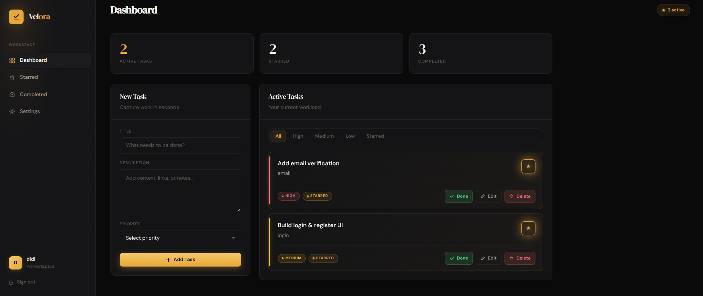
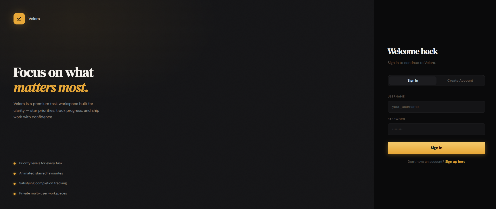
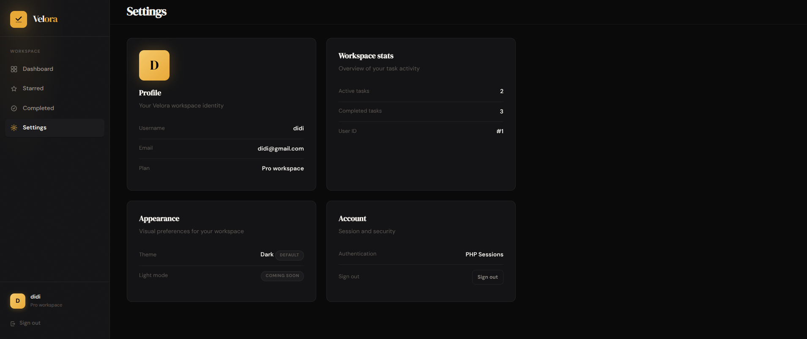
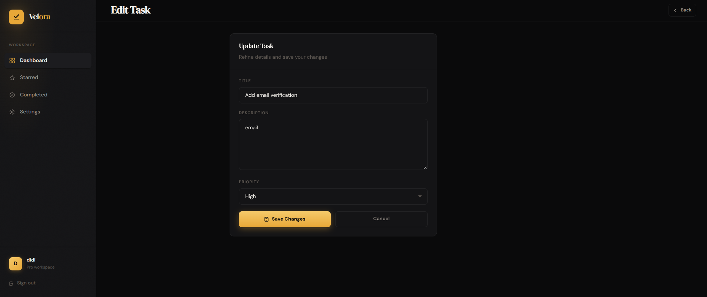

<div align="center">

# Velora ✓

**A premium, minimal task management SaaS — built for focus and flow.**  
Dark editorial design · Warm amber accents · Production-ready full stack.


[](https://php.net)
[](https://mysql.com)
[](https://getbootstrap.com)
[](LICENSE)

</div>

---

## Overview

**Velora** is a full-stack, multi-user task management platform with a startup-quality UI. It combines a dark modern aesthetic, logo-driven amber branding, smooth micro-interactions, and a clean PHP/MySQL backend — ideal for portfolios, learning, or as a SaaS starter.

The brand mark (check + list lines) drives the entire design system: charcoal surfaces, amber CTAs, and refined typography via **DM Sans** and **DM Serif Display**.

---

## Screenshots

| Dashboard | Starred | Completed |
|-----------|---------|-----------|
|  |  |

| Sign In | Settings | Edit Task |
|---------|----------|-----------|
|  |  |  |

---

## Features

### Core
- **Authentication** — Register, login, logout with `password_hash` and PHP sessions
- **Dashboard** — Live stats, create-task panel, filterable active task list
- **CRUD** — Create, edit, delete tasks with ownership checks
- **Completion** — One-click complete with dedicated completed view
- **Starred tasks** — Animated gold stars, glow effects, priority hero section
- **Multi-user** — Tasks scoped per `user_id`; no cross-account access

### UX & UI
- **Design system** — CSS tokens, spacing scale, semantic colours, shadows
- **Priority system** — High / Medium / Low badges and side-stripes
- **Client-side filters** — All, priority, and starred filters on dashboard
- **Responsive sidebar** — Collapsible mobile nav with overlay
- **Animations** — Card stagger, star pulse, ripple buttons, page enter
- **Settings page** — Profile, workspace stats, appearance placeholders
- **Accessibility** — ARIA labels, keyboard-friendly auth tabs

---

## Tech Stack

| Layer | Technology |
|-------|------------|
| Frontend | HTML5, CSS3 (tokens + shared components + app shell), Vanilla JS |
| Backend | PHP 8.0+ |
| Database | MySQL 8.0+ |
| Fonts | [DM Sans](https://fonts.google.com/specimen/DM+Sans), [DM Serif Display](https://fonts.google.com/specimen/DM+Serif+Display) |

---

## Folder Structure

```
task-manager/
├── assets/
│   ├── css/
│   │   ├── tokens.css       # Design tokens (colours, spacing, motion)
│   │   ├── base.css         # Reset, textures, shared base
│   │   ├── components.css   # Buttons, forms, panels (auth + app)
│   │   ├── style.css        # App shell — dashboard, tasks, sidebar
│   │   └── auth.css         # Auth layout only
│   └── favicon.svg          # Brand favicon (logo on amber)
├── includes/
│   ├── db.php               # MySQL connection
│   ├── head-app.php         # Shared head for app pages
│   ├── sidebar.php          # Shared sidebar navigation
│   └── redirect.php         # Safe post-action redirects
├── js/
│   ├── script.js            # Sidebar, filters, ripple, stars
│   └── auth.js              # Auth tab switching
├── index.php                # Dashboard
├── login.php                # Sign in + sign up (tabs)
├── register.php             # Registration handler
├── edit.php                 # Edit task
├── completed.php            # Completed tasks
├── priority.php             # Starred tasks
├── settings.php             # User settings
├── complete_task.php        # Mark complete (action)
├── toggle_star.php          # Toggle star (action)
├── delete.php               # Delete task (action)
├── logout.php               # Destroy session
└── README.md
```

---

## Installation

### Prerequisites

- PHP 8.0 or newer
- MySQL 8.0+ (or MariaDB 10.4+)
- Apache or Nginx with PHP (XAMPP, Laragon, MAMP, etc.)

### Steps

```bash
git clone https://github.com/yourusername/velora.git
cd velora

# Copy to your web root, e.g.:
# sudo cp -r . /var/www/html/task-manager/
```

Open `http://localhost/task-manager/login.php` (adjust path to your setup).

---

## Database Setup

```sql
CREATE DATABASE task_manager;
USE task_manager;

CREATE TABLE users (
  id         INT AUTO_INCREMENT PRIMARY KEY,
  username   VARCHAR(80)  NOT NULL UNIQUE,
  email      VARCHAR(180) NOT NULL UNIQUE,
  password   VARCHAR(255) NOT NULL,
  created_at TIMESTAMP DEFAULT CURRENT_TIMESTAMP
);

CREATE TABLE tasks (
  id          INT AUTO_INCREMENT PRIMARY KEY,
  user_id     INT NOT NULL,
  title       VARCHAR(200) NOT NULL,
  description TEXT,
  priority    ENUM('High','Medium','Low') DEFAULT 'Low',
  completed   TINYINT(1) DEFAULT 0,
  starred     TINYINT(1) DEFAULT 0,
  created_at  TIMESTAMP DEFAULT CURRENT_TIMESTAMP,
  FOREIGN KEY (user_id) REFERENCES users(id) ON DELETE CASCADE
);
```

Configure `includes/db.php`:

```php
<?php
$host = "localhost";
$user = "your_db_user";
$password = "your_db_password";
$database = "task_manager";

$conn = mysqli_connect($host, $user, $password, $database);
if (!$conn) die(mysqli_connect_error());
```

---

## Authentication

| Mechanism | Detail |
|-----------|--------|
| Password storage | `password_hash()` / `password_verify()` (bcrypt) |
| Session keys | `$_SESSION['user_id']`, `$_SESSION['username']` |
| Route protection | `session_start()` + redirect to `login.php` on protected pages |
| Task isolation | All queries include `WHERE user_id = '$user_id'` |

> **Production note:** Migrate SQL to **prepared statements** (`mysqli_prepare` or PDO) to prevent injection.

---

## Design System

Colours are derived from the login logo (amber `#E8A838` on charcoal `#0A0A0B`):

| Token | Value | Usage |
|-------|-------|-------|
| `--brand` | `#E8A838` | CTAs, stars, accents |
| `--bg` | `#0A0A0B` | Page background |
| `--surface-1` | `#141416` | Cards, sidebar |
| `--pri-high` | `#F87171` | High priority |
| `--pri-medium` | `#FBBF24` | Medium priority |
| `--pri-low` | `#4ADE80` | Low priority |

Edit `assets/css/tokens.css` to retheme the entire app.

---

## Roadmap

- [ ] Prepared statements / PDO
- [ ] Due dates and overdue states
- [ ] Full-text task search
- [ ] Drag-and-drop reorder
- [ ] Labels and projects
- [ ] Light mode toggle
- [ ] Email notifications
- [ ] REST API
- [ ] Bulk actions on completed tasks

---

## Author

Built with care by **[Your Name]**

- [GitHub](https://github.com/yourusername)
- [Portfolio](https://yoursite.com)

---

## License

MIT — free to use, modify, and distribute.  
See [LICENSE](LICENSE) for full terms.

---

<div align="center">
  <sub>Velora — focus on what matters most.</sub>
</div>
